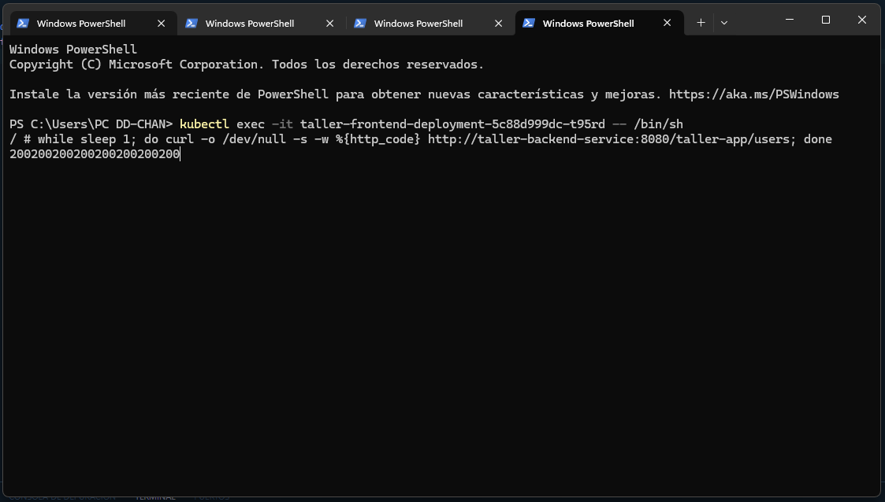
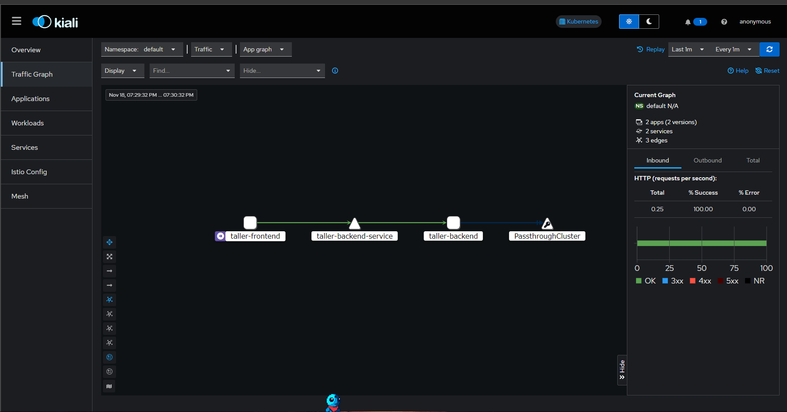

# Reporte de Proyecto V2
### Modificaciones realizadas
- Se hicieron cambios en los puertos 
- Se realizaron solicitudes constantes desde el servicio del backend hacia el servicio del front para asergurar que ambos servicios se encuentren conectados
- Se monitorizo las conexiones de neustros servicios en kubernetes por medio de Istio con ayuda de Kiali y con el dashboard de Locust
- Se realizo ingenieria del caos con ayuda de la herramienta Cheeky Monkey

### Comenzamos mostrando las solicitudes realizadas
Para simular las solicitudes que se generarian desde nuestro Frontend podriamos directamente estar haciendo solicitudes desde neustro navegador, sin embargo consideramos que con fines practicos y mantenerno constantemente enviando solicitudes lo que hariamos seria ingresar a alguno de nuestros pod y desde esa sesion estar enviando solicitudes al servicio del back como se ve en la siguiente foto.

Ademas tambien podemos con ayuda de isito ver graficamente que las solicitudes estan siendo exitosas a traves de nuestro servicio.

### Uso de Cheeky Monkey

Como podemos ver en el video tenemos 3 ventanas abiertas:
- Locust de Fondo corriendo en el puerto 8089 mandando solicitudes al puerto 80 que es donde se encuentra nuestro servicio Frontend
- La consola donde se encuentra corriendo nuestro Cheeky Monkey ( lo usaremos para ver los pods que estan siendo finalizados )
- La interfaz grafica de Cheeky Monkey

Como pudimos observar en el video tenemos que a traves de Cheeky Monkey estamos matando pods, sin embargo de fondo podemos observar como Locust continua haciendo las solicitudes a nuestro servicio Frontend y esta no se encuentra dando ningun error, esto es debido a Kubernetes, esto ya que a pesar de que estemos matando constantemente los pods del frontend, kubernetes por defecto los vuelve a levantar permitiendo de esta manera una conexion tolerante a fallas.

---------------------------------------------------------------------------------------------------------------------------------------------------------------------------------

Despues de que clones el repositorio, dirijete al directorio del proyecto, ahi debes copiar el contenido del archivo example.env hacia un nuevo archivo. Por ejemplo:

cp example.env .env

De esta forma habrás copiado el contenido de la plantilla a tu archivo .env

Configura tu archivo .env con tus credenciales personalizadas de tu base de datos, tu usuario  y contraseña. Una vez hecho esto, ejecuta la clase main que se llama TallerApplicaition.java. En la parte superior de 
IntelliJ, al lado del boton de ejecutar hay un dropdown, ahi seleccionas editar configuraciones. Ahi añades tu archivo .env en la seccion de variables de entorno. Hecho esto ya deberia de funcionar la aplicacion de Springboot
